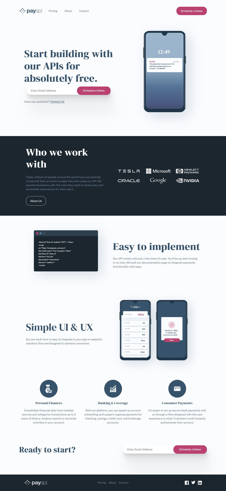

# Frontend Mentor - Blogr landing page solution

This is a solution to the Payapi landing page design, is a react static application, it uses react-router v6, vite and of course react 

## Table of contents

- [Overview](#overview)
  - [The challenge](#the-challenge)
  - [Screenshot](#screenshot)
  - [Links](#links)
- [My process](#my-process)
  - [Built with](#built-with)
  - [What I learned](#what-i-learned)
  - [Continued development](#continued-development)
- [Author](#author)

## Overview

### The challenge

Your users should be able to:

* View the optimal layout for each page depending on their device's screen size
   * See hover states for all interactive elements throughout the site
  *  Receive an error message when the contact form is submitted if:
   * The Name, Email Address or Message fields are empty should show "This field can't be empty"
   * The Email Address is not formatted correctly should show "Please use a valid email address"

### Screenshot

### Links

- Solution URL: [https://github.com/Silkiercomet/payapi-full-website-react/tree/main](https://github.com/Silkiercomet/payapi-full-website-react/tree/main)
- Live Site URL: [https://648e056638df293626152fc3--remarkable-gnome-d5ba5b.netlify.app/](https://648e056638df293626152fc3--remarkable-gnome-d5ba5b.netlify.app/)

## My process

I started by creating a pseudo-mockup of the page, that alllow me to set up the routing and the pages component that i wanted to be display on each route

later I started from the smaller components (the end of the three) and ended populating the routes with the section components (the root of the three)

### Built with

- Semantic HTML5 markup
- CSS modules
- Flexbox
- CSS Grid
- Mobile-first workflow
- BEM notation
- react
- vite
- react-router
- react-form-hook

### What I learned

to deploy a vite app the proccess is different that what i would do for a CRA application, i needed to just build the app, by using the respective command and manually deploy it using netlify 

react router v6 made react router for me, it works in a more intuitive way that before and maybe because of the simplicity of this app (i bet that with dynamic routes would be more complex) it was easy and fun to use

### Continued development

I need to create a few background images and Modal for the case of success in completing the form

## Author

- Website - [Add your name here](https://luis-colina-portfolio.netlify.app/)

